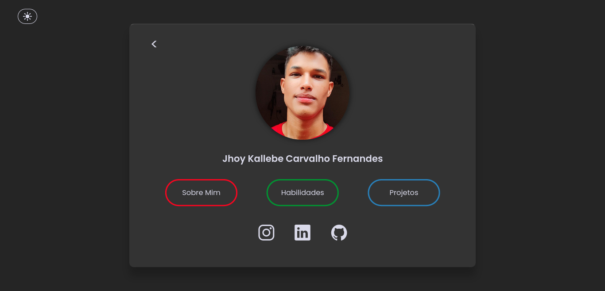
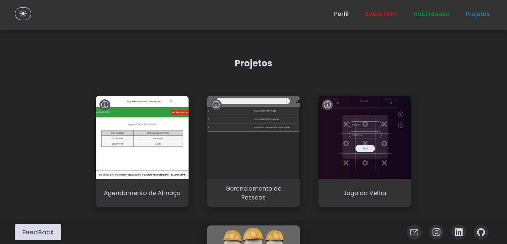

# Meu Portfólio

  

 

  

> Projeto desenvolvido com intuito de aprimorar minhas habilidades com a linguagem JavaScript.
### Ajustes e melhorias
Projeto em desenvolvimento:
- [x] Front-end
  - [x] HTML
    - [x] Desenvolver estrutura da página
  - [x] CSS
    - [x] Animações e estilizações
  - [x] JavaScript
    - [x] Light Mode
    - [x] Interações com o usuário
    - [ ] Visualização em carrossel das imagens dos projetos

### 🤝 Colaboradores

<table>
  <tr>
    <td align="center">
      <a href="https://github.com/Jhoy-Kallebe">
         
        
          <b>Jhoy Kallebe</b>
        
      </a>
    </td>
  </tr>
</table>

### 📝 License

MIT

## Acesse <a href="https://jhoy-kallebe.github.io/Portfolio/src/app/">AQUI!</a>

[⬆ Voltar ao topo](#meu-portfólio) 
